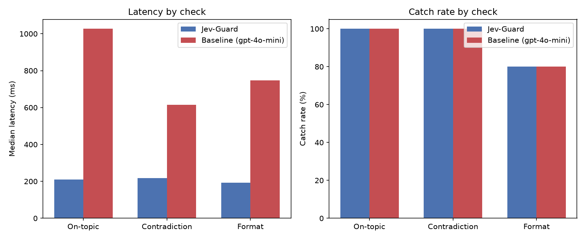

# Jev-Guard

[](https://github.com/omkarchougule19/Jev_validation_agent/actions/workflows/tests.yml)

[](LICENSE)
[](https://jev-guard-demo.onrender.com)

A fast, cheap way to double-check an LLM's answer before you show it to a
user — using **Jev** (TypeSafe AI's decision-only model) instead of asking
a second full LLM to grade the first one.

## The problem

You've got an LLM answering questions. Before that answer goes out, you
probably want to check a few things: did it actually answer the question?
Does it contradict the source material you gave it? Is it in the format
you asked for?

The usual way to check this is to ask *another LLM* — "hey GPT, does this
answer make sense?" That works, but it's slow and it costs real money,
every single time, for what's really just a yes/no or pick-one decision.

Jev-Guard swaps that grading step for Jev, a model built specifically for
bounded decisions like this — not for writing text. It answers in about
0.2 seconds, roughly 2x faster and 4x cheaper than gpt-oss-120b on Groq
(and 4x faster than gpt-4o-mini) in our tests, at the same accuracy, for
exactly the kind of question a guardrail check actually is.

## How it works

Three checks, each one Jev call:

| Check | Question | Jev primitive |
|---|---|---|
| **On-topic** | Does the answer actually address what was asked? | `Noul` (yes/no) |
| **Contradicts source** | Does the answer agree with the context it was supposed to be based on? Graded 0 (consistent) to 1 (flat contradiction), not just yes/no. | `Score` |
| **Right format** | Is the answer in the structure you asked for (e.g. valid JSON)? | `Choice` |

```python
from jev_guard import guard, make_client

client = make_client()
overall, results = guard(
    client,
    answer="Paris is the capital of France.",
    question="What is the capital of France?",
    context="France's capital city is Paris.",
)
print(overall)  # "pass" | "flag" | "block"
```

Each check returns `pass`, `flag` (worth a second look), or `block`. The
overall verdict is the worst of whichever checks you ran.

**If a check's API call fails** (timeout, rate limit, auth error), it
doesn't crash `guard()` — a guardrail that takes down your app on its own
infrastructure hiccup is worse than one that degrades gracefully. It
defaults to flagging that check for human review (`on_error="flag"`);
pass `on_error="block"` for a stricter fail-closed policy if that's the
right call for your use case.

## Does it actually work? (measured, not claimed)

Built a test set of 100 made-up examples across the three checks and ran
every one through both Jev-Guard and a normal "ask an LLM to grade it"
baseline, scored against the exact same pass/flag/block thresholds for
both, so it's a fair comparison of the *judge*, not the policy.

The current baseline is OpenAI's open-weight **gpt-oss-120b on Groq**
(reasoning set to "low"), run on 2026-09-24. Groq runs models on custom
chips built for speed, so this is a much tougher opponent than a typical
hosted chat model.



| Check | Jev caught | gpt-oss-120b caught | Jev latency (median) | gpt-oss-120b latency (median) |
|---|---|---|---|---|
| On-topic | 100% | 100% | 177ms | 314ms |
| Contradicts source | **100%** | 92% | 181ms | 411ms |
| Right format | 90% | **100%** | 182ms | 404ms |

All 100 cases, one after another: **Jev 22.4 s, gpt-oss-120b 41.6 s**,
so Jev was about **1.9x faster** end to end. Jev had no false alarms;
gpt-oss-120b had one (it called an empty JSON array `[]` invalid).

**The test set has a deliberately hard tier.** 20 of the 100 cases are
subtle near-misses: a partially-relevant answer that never actually
answers the question, a transposed digit, a date that's off by a year, a
price that's close but wrong.

| Check | Difficulty | n | Jev caught | gpt-oss-120b caught |
|---|---|---|---|---|
| On-topic | easy | 15 | 100% | 100% |
| On-topic | **hard** | 10 | **100%** | **100%** |
| Contradicts source | easy | 15 | 100% | 100% |
| Contradicts source | **hard** | 10 | **100%** | **80%** |

gpt-oss-120b's two misses were both small number changes that it let
through (a product weighing 2.5 kg when the source says 2 kg; 38 mpg when
the source says 35). Jev's one miss was on format: it accepted
`{name: "Alice", age: 30}` (unquoted keys) as valid JSON.

**Are the accuracy differences real, or noise?** A bootstrap confidence
interval on the catch-rate gap (5,000 resamples) says none of them are
statistically significant at this sample size: on-topic +0% [0%, 0%],
contradiction +8% [0%, +20%], format -10% [-30%, 0%]. The honest summary
is **about the same accuracy, roughly 2x faster and 4x cheaper**.

**Against gpt-4o-mini** (an earlier run, 2026-09-22, via OpenRouter),
the gap was bigger: same catch rates (100% / 100% / 80%), with baseline
medians of 1,027 / 614 / 748 ms, and 22.0 s vs 89.9 s for all 100 cases,
about **4x faster**. How much faster Jev is depends on what you compare it
with, so both numbers are listed.

**The format check is the weakest one.** Spot-checking the live demo
turned up misses on a missing closing brace, a missing comma and a
trailing comma, all passed as valid JSON. Treat it as a soft signal and
use a real parser when you need strict JSON.

**Cost, at list prices** (worked out from the token counts of this run):

| Judge | Price | Tokens per check (avg) | Cost per check | Per 1M checks |
|---|---|---|---|---|
| **Jev** (OpenRouter) | $0.042 / 1M input, output free | 316 in, 21 out | $0.0000133 | **$13.26** |
| gpt-oss-120b (Groq paid tier) | $0.15 / 1M input, $0.60 / 1M output | 159 in, 51 out | $0.0000547 | $54.72 |
| gpt-4o-mini (OpenRouter, earlier run) | $0.15 / 1M input, $0.60 / 1M output | ~61 in, ~11 out | $0.0000160 | $15.97 |

Jev reads more input tokens (its prompt format is longer), but it only
charges for input, while gpt-oss-120b's reasoning is billed as output at 4x
the input rate. So Jev came out **about 4x cheaper than gpt-oss-120b**
and about 1.2x cheaper than gpt-4o-mini. Jev's figure matches what the
OpenRouter key was actually billed (5 calls cost $0.000062). The benchmark
itself ran gpt-oss-120b on Groq's free tier, so its cost here is what the
same calls would cost on the paid tier.

Raw results from the run: `results/report.json` (gitignored, regenerate
it yourself). Re-run everything, including the chart above, with
`python -m jev_guard.report`. It needs `OPENROUTER_API_KEY` (for Jev) and
a free `GROQ_API_KEY` (for the baseline), and takes a few minutes because
it's paced to stay inside Groq's free limits.

## Install

```bash
pip install git+https://github.com/omkarchougule19/Jev_validation_agent
```

That installs just the library (its only dependency is `typesafe-sdk`).
Set `OPENROUTER_API_KEY` in your environment and you're ready to call
`guard()`. Jev is reached through [OpenRouter](https://openrouter.ai), so
no TypeSafe-specific account is needed. Re-running the benchmark or the
race also needs a free [Groq](https://console.groq.com) key
(`GROQ_API_KEY`) for the comparison judge.

Optional extras: `[report]` for re-running the benchmark and chart,
`[demo]` for the live demo page, `[dev]` for the tests.

### Working on the repo itself

```bash
python -m venv .venv
source .venv/bin/activate  # or .venv\Scripts\activate on Windows
pip install -r requirements.txt  # editable install with every extra
cp .env.example .env  # fill in OPENROUTER_API_KEY and GROQ_API_KEY
python -m pytest
```

## Live demo

**Try it: [jev-guard-demo.onrender.com](https://jev-guard-demo.onrender.com)**
(free hosting, so the first visit after a quiet spell can take up to a
minute to wake up).

A single page where you paste a question, an answer, and optional source
context, and watch Jev-Guard verdict it in real time, with the benchmark
numbers alongside.

There's also a **speed race** at [`/race`](https://jev-guard-demo.onrender.com/race):
Jev and gpt-oss-120b (on Groq) check the same 25 answers, picked at random
from the test set, live and side by side, with every call's result,
timing and cost shown as it lands, plus a projected cost per million
checks for each. Because the baseline runs on Groq's free tier
(30 requests a minute), races run one at a time, at least a minute apart,
with a small daily cap (`RACE_DAILY_CAP`, default 10). When a limit is
reached the page says so.

```bash
pip install "jev-guard[demo] @ git+https://github.com/omkarchougule19/Jev_validation_agent"
python -m jev_guard.demo  # then open http://localhost:8000
```

To host it, use the included `Dockerfile` (it listens on `$PORT`, 7860 by
default; the live copy runs on Render's free tier) and set
`OPENROUTER_API_KEY` and `GROQ_API_KEY` as secrets on the host. A hosted copy spends your
OpenRouter credits, so inputs are capped at 4,000 characters and each IP
gets 10 checks a minute.

## Project layout

```
src/jev_guard/
├── client.py    # thin Jev wrapper (Noul / Choice / Score), via OpenRouter
├── checks.py    # the 3 checks + their pass/flag/block thresholds
├── guard.py     # guard() — runs the checks you ask for, rolls up a verdict
├── baseline.py  # the "ask a full LLM to grade it" comparison judge (gpt-oss-120b on Groq)
├── testset.py   # the 100 made-up test examples (easy + hard tiers)
├── report.py    # runs the test set through both, scores it, charts it
└── demo/        # FastAPI app: the checker page and the live speed race
tests/           # unit tests for the decision logic (no API calls needed)
assets/          # the comparison chart shown above
pyproject.toml   # packaging: pip-installable, with optional extras
Dockerfile       # container for hosting the demo
.github/workflows/tests.yml  # CI: runs the test suite on every push
```

## Why it's built this way

This is deliberately small on purpose: a made-up test set instead of a
real dataset, three checks instead of a plugin framework, one provider
(OpenRouter) instead of several. See `plan.md` for the reasoning behind
the scope.
